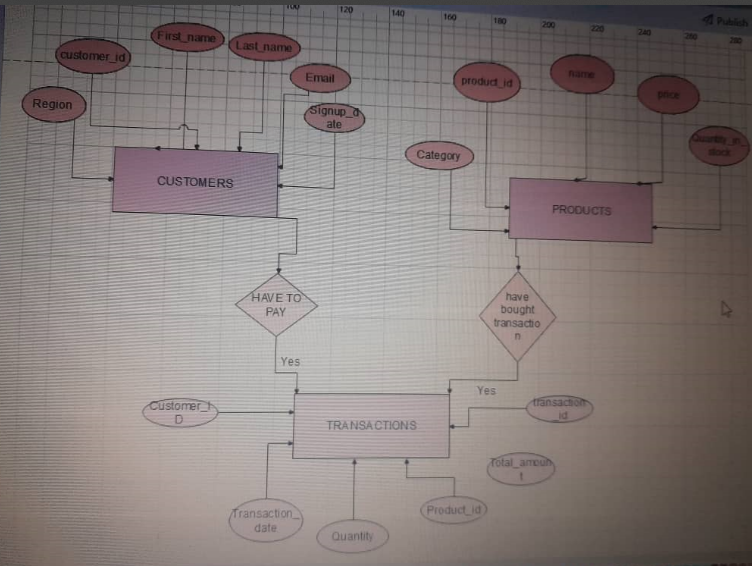

# PL/SQL WINDOW FUNCTION PROJECT E-CORMMERCIAL PROJECT ANALYTIC  
## STEP1:Problem Defintion  

***BUSINESS CONTEXT:*** **SHOPRWANDA,A REGIONAL E-CORMMERCE PLATFORM-SALES&ANALYTICS TEAM**  

**data challenge**:from january through december 2025, ShopRwanda recorded thousands of products purchases accross different provences.however,the company lacks clear insights into the top-selling products in each region and quarter,monthly sales growth trends and customer spending behaviour.  
**expected outcome**:identify the top 5 products per region and quarter,calculate the cumulative monthly sales total,analyse month-over-month growth and classify customers into quartiles based on revenue contribution.these insights will guide inventory planning,targeted marketing and customer retention strategies.  
## STEP2:Success Criteria  
we will use the following 5 measurable goals to guide our SQL WINDOW FUNCTION to analyse for SHOPRWANDA.
1. ***Top 5 products per region and quarter→RANK()*** 
indentify which products generate the highest sales in each region per quarter to support promotional campaigns and inventory prioritization  
2. ***running monthly sales totals→SUM()OVER()***  
track cumulative monthly sales for each region or product to detect growth patterns and long-term performances trends 
3. ***Month-0ver-month sales growth→LAG()/LEAD()***
compare monthly sales against the previous or next month to highlight growth,decline or seasonal changes in customers demands   
4. ***Customer spending quartiles→NTILE(4)***  
Segment customers into fours based on annual spending to design targeted marketing strategies for high-values and low-values customers   
5. ***monthly moving averages of sales→AVG()OVER()***  
calculater rolling 3-months avaerage sales to smooth out fluctuational and identify underlying sales trends for better forecasting     
## step 3:Database schema  
i desgined THE DATABASE called E-CORMMERCE using MYSQL WORKBENCH which has 3 related tables which are Customers,products,transactions for ShopRwanda e-commmerce platform the tables are connect by foreign keys.  
1. CUSTOMERS TABLE

2. PRODUCTS TABLE

3. TRANSACTIONS TABLE 

<table>
  <tr>
    <th>Table Name</th>
    <th>Purpose</th>
    <th>Key Columns</th>
    <th>Example Row</th>
  </tr>
  <tr>
    <td>customers</td>
    <td>Stores customer information</td>
    <td>customer_id(PK),First_name,Last_name,email,Region,signup_date</td>
    <td>Ishimwe,Lambert,ishimwe.lambert1@example.com,Kigali,2025-09-01</td>
  </tr>
  <tr>
    <td>products</td>
    <td>Product catalog</td>
    <td>product_id (PK), name, price, category</td>
    <td>Inyange Milk 1L,1.20,50,Dairy</td>
  </tr>
  <tr>
    <td>transactions</td>
    <td>Purchase records</td>
    <td>transaction_id (PK), customer_id (FK → customers), product_id (FK → products), quantity, total_amount, transaction_date</td>
    <td>21,1,1,3,360000,2025-01-12</td>
  </tr>
</table> 

## ENTITY RELATION DIAGRAM(ERD) 



## STEP 4:WINDOW FUNCTION IMPLEMENTATION  

we implement four categories of pl/sql windows function in MYSQL WORKBENCH each section below show the query,a screenshot of results.  
### ***Ranking row_number(),rank(),dense_rank(),percent_rank()***  
query (ranking functions):  
### Running Monthly Sales Totals  

```sql
SELECT
    DATE_FORMAT(transaction_date, '%Y-%m') AS month,
    SUM(total_amount) AS monthly_sales,
    SUM(SUM(total_amount)) OVER(
        ORDER BY DATE_FORMAT(transaction_date, '%Y-%m')
    ) AS running_total
FROM Transactions
GROUP BY DATE_FORMAT(transaction_date, '%Y-%m')
ORDER BY month;  
```
## screenshot:
 OVER(.PNG>)
**interpretaion**:this Query shows the monthly sales revenue  and a cumulative running total over time.it helps track growth and compare how sales accumulate month after month.
### Customer Quartiles NTILE(4) 

```sql 
SELECT
    c.customer_id,
    CONCAT(c.first_name, ' ', c.last_name) AS customer_name,
    SUM(t.total_amount) AS total_revenue,
    NTILE(4) OVER(ORDER BY SUM(t.total_amount) DESC) AS revenue_quartile
FROM Transactions t
JOIN Customers c ON t.customer_id = c.customer_id
GROUP BY c.customer_id
ORDER BY total_revenue DESC;
```
## screeenshot:

**interprentation**this divide customers into Quartiles based on the revenue.Quartile 1 represents top customers,while  quartile 4 represents lower-revenue customers.it's useful for customer segmentantion.
### monthly moving average AVG()OVER() 
```sql 
SELECT
    DATE_FORMAT(transaction_date, '%Y-%m') AS month,
    SUM(total_amount) AS monthly_sales,
    ROUND(
        AVG(SUM(total_amount)) OVER(
            ORDER BY DATE_FORMAT(transaction_date, '%Y-%m')
            ROWS BETWEEN 2 PRECEDING AND CURRENT ROW
        ), 2
    ) AS moving_avg_3m
FROM Transactions
GROUP BY DATE_FORMAT(transaction_date, '%Y-%m')
ORDER BY month;
```
### screenshot:

***interprentation***this calculate a 3-months moving average of sales it smooths out fluctuations to highlight longer-term sales trends 
### Aggregate Functions with Frame Comparisons
```sql
-- Using MIN, MAX, AVG with ROWS vs RANGE frames
SELECT
    DATE_FORMAT(transaction_date, '%Y-%m') AS month,
    SUM(total_amount) AS monthly_sales,
    SUM(SUM(total_amount)) OVER(ORDER BY DATE_FORMAT(transaction_date, '%Y-%m') ROWS BETWEEN UNBOUNDED PRECEDING AND CURRENT ROW) AS running_total_rows,
    SUM(SUM(total_amount)) OVER(ORDER BY DATE_FORMAT(transaction_date, '%Y-%m') RANGE BETWEEN UNBOUNDED PRECEDING AND CURRENT ROW) AS running_total_range
FROM Transactions
GROUP BY DATE_FORMAT(transaction_date, '%Y-%m')
ORDER BY month;
```

***interprentation***:this show the difference between ROWS and RANGE in windows functions. ROWS counts physical rows in order,while RANGE considers all rows with the same value in the ordering expression.
### DISTRIBUTION:NTILE(4),CUME_DIST()
```sql 
-- NTILE and CUME_DIST for customer segmentation
SELECT
    c.customer_id,
    CONCAT(c.first_name, ' ', c.last_name) AS customer_name,
    SUM(t.total_amount) AS total_revenue,
    NTILE(4) OVER(ORDER BY SUM(t.total_amount) DESC) AS quartile,
    ROUND(CUME_DIST() OVER(ORDER BY SUM(t.total_amount) DESC), 2) AS cumulative_distribution
FROM Transactions t
JOIN Customers c ON t.customer_id = c.customer_id
GROUP BY c.customer_id
ORDER BY total_revenue DESC;
```
### screenshot:
_CUME_DIST().PNG)
Interpretation

NTILE(4) splits customers into 4 equal groups by revenue.
CUME_DIST() shows the cumulative distribution (e.g., customer in position 0.75 means 75% of customers have less revenue).
# Step 5:results analysis 
Descriptive(what happened)
The analysis shows that a small number of products dominated sales across all provinces, while many other products recorded modest but consistent sales. Monthly sales totals exhibited seasonal patterns with noticeable peaks during back-to-school and holiday periods. Customer segmentation revealed that roughly 25% of shoppers generated the majority of revenue, while a larger segment purchased only occasionally or in smaller amounts.  
***Diagnostic (Why?)***
This concentration of sales among a few products suggests that promotions, brand recognition, or necessity goods strongly drive purchasing decisions. Seasonal spikes likely reflect predictable events such as school terms, holidays, and cultural festivals when households increase spending. Lower-quartile customers may reflect occasional buyers, low purchasing power, or lack of personalized offers, indicating missed opportunities for engagement.  
***Prescriptive (What next?)*** 
ShopRwanda should leverage these insights by prioritizing stock and promotions for top-selling products in each province and quarter. Targeted marketing campaigns should be designed to reward high-value customers and re-engage low-spend segments through personalized discounts, recommendations, or loyalty programs. Monitoring rolling three-month averages and quartile movements will help adjust inventory and campaigns quickly, improving forecasting and retention.  
# Step 6:References
1. MYSQL WORKBENCH https://www.mysql.com/products/workbench/
2. MYSQL WORKBENCH WINDOW FUNCTION CONCEPTS https://www.mysql.com/products/workbench/ 
3. E-DRAW MAX for ENTITY RELATION DIAGRAM https://www.edrawmax.com/
4. W3SCHOOL ONLINE used for learning SQL QUERY https://www.w3schools.com/
5. GeeksforGeeks — SQL | Window Functions https://www.geeksforgeeks.org/sql-window-functions/
6. SQL Shack — Practical Examples of Window Functions https://www.sqlshack.com/sql-window-functions-overview-and-examples/)
7. VSCODE for writing README.MD https://code.visualstudio.com/

***Statement of Originality***  
All sources have been properly cited. The implementations and analysis are original work. No AI-generated content was used without proper attribution or adaptation.


